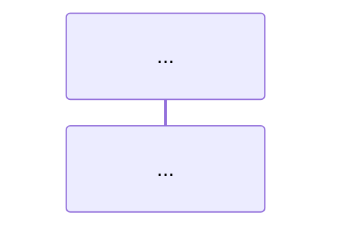
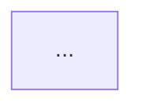

# Auction Portal Clone – Full Software Design Prompt

You are a senior software architect specializing in reverse-engineering ASP.NET Core MVC applications.

Your task is to perform a **complete static analysis** of the entire "Auction Portal Clone" codebase and produce a full software design package.

### Project Context
This is an ASP.NET Core MVC (.NET 10) bank auction portal with:
- Public catalogue browsing + filtering
- User registration / login (local + Google OAuth)
- Bidding system with verification
- Saved listings
- BankStaff admin panel (create/edit auctions, dashboard, reports)
- Automatic auction winner determination via background hosted service
- Email notifications
- Image/document uploads + ImageSharp.Web resizing
- Location hierarchy (Province → District → Municipality)
- EF Core + SQL Server + ASP.NET Identity

### Mandatory Full Scan
Thoroughly examine **every relevant file**:

**Controllers/**
- AuctionCatalogController.cs
- BidController.cs
- LoginController.cs, RegisterController.cs, LogoutController.cs
- SavedListingController.cs
- UserProfileController.cs
- HomeController.cs
- Admin/AdminAuctionItemController.cs
- Admin/AdminDashboardController.cs
- Admin/AdminReportController.cs

**Services/** (Interfaces + Implementations)
- AuctionCatalogService, BidService, SavedListingService
- AdminAuctionItemService, AdminDashboardService, AuctionReportService
- AuctionWinnerService + AuctionWinnerHostedService
- AttachmentUploadService, GmailEmailSender
- AuctionFilterService, AuctionStatusResolver, AdminViewDataHelper

**Models/**
- AuctionItem, Bid, User, Category, CollateralCategory
- ItemAttachment, SavedListing
- Province, District, Municipality

**Data/**
- AuctionDbContext.cs
- DbSeeder.cs

**DTOs/** (all of them)
**Migrations/** (especially the latest snapshot)
**Program.cs** (DI, Identity, hosted services, middleware)

Do **not** invent features. Base everything strictly on the actual code.

### Required Output (strict structure)

Produce the following five sections using **Mermaid** syntax (preferred for readability) or PlantUML if relationships are very complex.

---

## 1. Use Case Diagram

- Identify all actors: Guest, Registered User (Bidder), Verified Bidder, BankStaff (Admin), Background Worker, Email System, Google OAuth
- List all major use cases grouped by area (Public Catalogue, Authentication, Bidding, Saved Listings, Admin Management, Auction Settlement)
- Show relationships (include, extend, generalization)
- Provide a short description of each major use case

```mermaid
usecaseDiagram
    ...
```

---

## 2. Sequence Diagrams

Create **separate sequence diagrams** for these critical flows (at minimum):

1. User Registration + Email/Google Verification
2. Login (local + Google)
3. Browse Catalogue + Apply Filters
4. Place a Bid
5. Save / Unsave Listing
6. Admin Create/Edit Auction Item (with file upload)
7. Auction Winner Determination (Background Hosted Service)
8. Winner Notification Email
9. Admin Report Generation + Manual Finalize

Use this format for each:



---

## 3. Activity Diagrams

Create activity diagrams for the most complex processes:

1. Complete Auction Lifecycle (Draft → Active → Ended → Sold/Unsold)
2. Bid Placement + Validation
3. Automatic Winner Determination logic (including reserve price, tie-breaking, email)
4. Admin Auction Item Creation flow



---

## 4. Class Diagram

Show the core domain model + key application services:

- Domain entities: AuctionItem, Bid, User, Category, CollateralCategory, ItemAttachment, SavedListing, Province/District/Municipality
- Key relationships and multiplicities
- Important services and their interfaces
- DTOs that are central (AuctionItemDetailDTO, BidDTO, etc.)
- Focus on the real domain — do not dump every controller method

```mermaid
classDiagram
    ...
```

---

## 5. Entity-Relationship Diagram (ERD)

Derive the real database schema from `AuctionDbContext` + migrations + entity configurations.

Show:
- All tables/entities
- Primary keys
- Foreign keys + cardinality (1:1, 1:N, N:M)
- Important columns (especially auction status fields, winner fields, dates, reserve price, etc.)

```mermaid
erDiagram
    ...
```

---

### Final Section

**Architecture Summary**
- Overall layered architecture
- Patterns used (Repository? Service Layer? Hosted Services? Identity? etc.)
- Key design decisions observed in the code
- Notable strengths and potential improvement areas

### Rules
- Be extremely accurate — only document what actually exists in the code.
- Prefer Mermaid for all diagrams.
- Use clear Markdown headings exactly as shown above.
- If a flow is complex, break it into multiple focused diagrams rather than one giant diagram.
- Start the analysis immediately.
```

---

**How to use this file:**

1. Open your Auction Portal Clone project in the AI agent (Cursor / Claude / ChatGPT / Grok / etc.).
2. Copy the entire content of this file and paste it as the prompt.
3. Make sure the agent has access to the full source code (especially Controllers, Services, Models, Data, DTOs, Migrations, and Program.cs).
```

The file has been created successfully at:

**`/home/workdir/artifacts/Auction-Portal-Design-Prompt.md`**

You can download it and use it directly with your agent. Would you like me to also create a shorter version or any other variation?